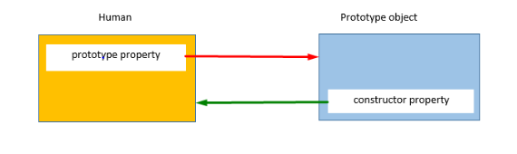
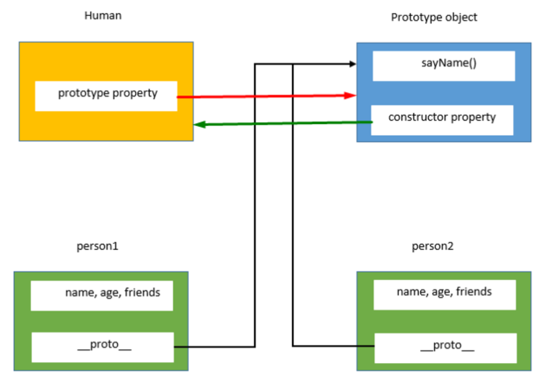
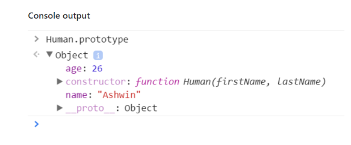

`//` hashes out code

multi line comments with `/*` and `*/`. Can also be used to comment out the middle of lines.

7 different data types in JavaScript:
* *Number*, including numbers with decimals.
* *String*, surround by single or double quotes, convention says single quotes.
* *Null*, represents the intentional absence of a value.
* *Boolean*, true or false.
* *Undefined*, represents the absence of data.
* *Symbol*, unique identifier.
* *Object*, collection of related data.

## GUARD CLAUSE

Simple guard clause

`sentence.includes(word)? 'is' : 'is not'`

## TYPEOF

`typeof` will return the type the javascript item is. *note if item is array `typeof` will still return `'object'`*

## STRINGS
`.length` on a string prints the number of characters in that string including spaces.
`.toUpperCase()` on a string turns that string to uppercase.
`.startsWith('H')` on a string is True or False if that string begins with 'H'.
`.trim()` on a string removes all the empty spaces.

### REGULAR EXPRESSIONS

Or *RegEx*.

Regular expressions are patterns used to match character combinations in strings. In JavaScript, regular expressions are also objects. These patterns are used with the exec and test methods of RegExp, and with the match, matchAll, replace, search, and split methods of String.

[MDN Web Docs - Regular Expressions](https://developer.mozilla.org/en-US/docs/Web/JavaScript/Guide/Regular_Expressions)


Methods that use regular expressions:
* **exec**:	A RegExp method that executes a search for a match in a string. It returns an array of information or null on a mismatch.
* **test**:	A RegExp method that tests for a match in a string. It returns true or false.
* **match**:	A String method that returns an array containing all of the matches, including capturing groups, or null if no match is found.
* **matchAll**:	A String method that returns an iterator containing all of the matches, including capturing groups.
* **search**:	A String method that tests for a match in a string. It returns the index of the match, or -1 if the search fails.
* **replace**:	A String method that executes a search for a match in a string, and replaces the matched substring with a replacement substring.
* **split**:	A String method that uses a regular expression or a fixed string to break a string into an array of substrings.

### NUMBERS
`Math.floor(6.88)` will return 6 or round down to the nearest whole number.
`Math.random()` generates a random number between 0 and 1.
`Math.ceil(6.88)` will return 7 or round up to the nearest whole number.
`Number.isInteger(2019)` will return true and for any other integer.

### OBJECTS
`Object.keys(objectName)` will return an array of a given objects property names.

### ASYNCHRONOUS JAVASCRIPT

The `Promise` object:
* Pending: the initial state -- the operation has not yet completed.
* Fulfilled: The operation has completed successfully and the promise now has a resolved value. For example, a request’s promise might resolve with a JSON object as its value.
* Rejected: The operation has failed and the promise has a reason for the failure. This reason is usually an Error of some kind.

### VAR vs. LET vs. CONST

`var` is function scoped

`let` is block scoped

`const` is block scoped. Cannot be reassigned a new value but object attributes can be changed.

### NEW SET

Lets you store unique values of any type, whether primitive values or object references.

```js
var mySet = new Set();

mySet.add(1); // Set [ 1 ]
mySet.add(5); // Set [ 1, 5 ]
mySet.add(5); // Set [ 1, 5 ]
```

### ARRAYS

* Loop over an array:
```js
fruits.forEach(function(item, index, array) {
  console.log(item, index);
});
```

or simpler:
```js
array1.forEach(function(element) {
  console.log(element);
});
```

**slice**

Returns a shallow copy of a portion of an array into a new array object selected from begin to end (end not included) where begin and end represent the index of items in that array.

```js
var animals = ['ant', 'bison', 'camel', 'duck', 'elephant'];

console.log(animals.slice(2));
// expected output: Array ["camel", "duck", "elephant"]

console.log(animals.slice(2, 4));
// expected output: Array ["camel", "duck"]

console.log(animals.slice(1, 5));
// expected output: Array ["bison", "camel", "duck", "elephant"]
```

## CODEWARS

```js
function accum(s) {
  return s.split('').map((c, i) => (c.toUpperCase() + c.toLowerCase().repeat(i))).join('-');
}
```

* Return unique characters in array:
```js
function longest(s1, s2) {
  return Array.from(new Set(s1 + s2)).sort().join('');
}
```

* removes all non letters and reverses:
```js
function reverseLetter(str) {
  return str.replace(/[^a-z]/gi, '').split('').reverse().join('')
}
```
or
```js
function reverseLetter(str) {
  return str.match( /[a-z]/gi ).reverse().join('')
}
```

* Tests for the number of character smiley faces in an array:
```js
function countSmileys(arr) {
  return arr.filter(x => /^[:;][-~]?[)D]$/.test(x)).length;
}
```

* Creating a mexican wave out of an array. Input/Ouput = `wave("hello") => ["Hello", "hEllo", "heLlo", "helLo", "hellO"]`:
```js
function wave(str){
    let result = [];
    
    str.split("").forEach((char, index) => {
        if (/[a-z]/.test(char)) {
            result.push(str.slice(0, index) + char.toUpperCase() + str.slice(index + 1));
        }
    });
    
    return result;
}
```

* solomonQuest
Here are what the values of each subarray represent:

  * Time Dilation: With each additional layer of time dilation entered, time slows by a factor of 2. At layer 0, time passes normally. At layer 1, time passes at half the rate of layer 0. At layer 2, time passes at half the rate of layer 1, and therefore one quarter the rate of layer 0.
  * Directions are as follow: 0 = North, 1 = East, 2 = South, 3 = West
  * Distance Traveled: This represents the distance traveled relative to the current time dilation layer. See below:

Input: `[[1,3,5],[2,0,10],[-3,1,4],[4,2,4],[1,1,5],[-3,0,12],[2,1,12],[-2,2,6]]`
Output: `[346,40]`

```js
function solomonsQuest(ar){
  const quest = {
    dilation: 0,
    location: [0, 0],
  }
  
  for (let [dilation, direction, distance] of ar) {
    quest.dilation += dilation
    
    for (let i = 0; i < quest.dilation; i++) {
      distance *= 2
    }
    
    if (direction === 0) {
      quest.location[1] += distance
    } else if (direction === 1) {
      quest.location[0] += distance
    } else if (direction === 2) {
      quest.location[1] -= distance
    } else if (direction === 3) {
      quest.location[0] -= distance
    }
  }
  
  return quest.location
}
```

* String Mix

```js
const alphabet = 'abcdefghijklmnopqrstuvwxyz'.split('');

function mix(s1, s2) {
  return alphabet
    .map(char => {
      const s1Count = s1.split('').filter(x => x === char).length,
            s2Count = s2.split('').filter(x => x === char).length,
            maxCount = Math.max(s1Count, s2Count);

      return {
        char: char,
        count: maxCount,
        src: maxCount > s1Count ? '2' : maxCount > s2Count ? '1' : '='
      };
    })
    .filter(c => c.count > 1)
    .sort((objA, objB) => objB.count - objA.count || (objA.src + objA.char > objB.src + objB.char ? 1 : -1))
    .map(c => `${c.src}:${c.char.repeat(c.count)}`)
    .join('/');
}
```

## Creating objects JavaScript

Great link for an intro into JavaScript classes: [Link](https://medium.com/tech-tajawal/javascript-classes-under-the-hood-6b26d2667677)

### The Constructor Function

```js

function Human(firstName, lastName) {
	this.firstName = firstName,
	this.lastName = lastName,
	this.fullName = function() {
		return this.firstName + " " + this.lastName;
	}
}

var person1 = new Human("Virat", "Kohli");
```

Each time a copy of the above function is created (i.e. a `person` is created) it will create the constructor function with copies of all properties and methods.

### Prototypes

When a function is created in JavaScript, the JavaScript engine adds a prototype property to the function. This prototype property is an object (called as prototype object) which has a constructor property by default. The constructor property points back to the function on which prototype object is a property. We can access the function’s prototype property using functionName.prototype.



As shown in the above image, Human constructor function has a prototype property which points to the prototype object. The prototype object has a constructor property which points back to the Human constructor function. Let’s see an example below:

`console.log(person1);` will return the prototype object

`console.log(Human.prototype)` will access the prototype property of the Human constructor function.

now if we create a second object `person2` using the `Human` constructor function



**Prototype Object**

As prototype object is an object, we can attach properties and methods to the prototype object. Thus, enabling all the objects created using the constructor function to share those properties and methods.

The new property can be added to the constructor function’s prototype property using either the dot notation or square bracket notation as shown below:

```js
Human.prototype.name = "Ashwin";
console.log(Human.prototype.name)//Output: Ashwin

//Square bracket notation
Human.prototype["age"] = 26;
console.log(Human.prototype["age"]); //Output: 26

console.log(Human.prototype);
```

will equal:


How to construct objects:

```js
//Define the object specific properties inside the constructor
function Human(name, age){
	this.name = name,
	this.age = age,
	this.friends = ["Jadeja", "Vijay"]
}
//Define the shared properties and methods using the prototype
Human.prototype.sayName = function(){
	console.log(this.name);
}
//Create two objects using the Human constructor function
var person1 = new Human("Virat", 31);
var person2 = new Human("Sachin", 40);

//Lets check if person1 and person2 have points to the same instance of the sayName function
console.log(person1.sayName === person2.sayName) // true

//Let's modify friends property and check
person1.friends.push("Amit");

console.log(person1.friends)// Output: "Jadeja, Vijay, Amit"
console.log(person2.friends)//Output: "Jadeja, Vijay"
```

### Module Exports

Useful youtube video at [link](https://www.youtube.com/watch?v=x6_EovBxST4)

**Simple Form**
In person.js:
```js
var person = function() {
  console.log('I am a person');
}

module.exports = person;
```

In app.js where we are invoking `person`:
```js
var person = require('./person')
person();
```
This will return `I am a person`

**Sharing multiple functions**
In person.js:
```js
var person = function() {
  console.log('I am a person');
}

var anotherPerson = function() {
  console.log('I am another person')
}

module.exports = {
  person: person,
  anotherPerson: anotherPerson
};
```

In app.js where we are invoking `person`:
```js
var people = require('./person');
people.person();
people.anotherPerson()
```
This will return `I am a person`