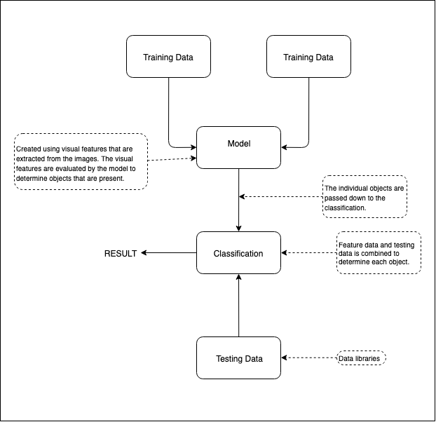

# Object Recognition

## DATA SCIENCE

**Logistic Regression**

Binary scoring system to demonstrate the probability of something happening. [Wikipedia Page](https://en.wikipedia.org/wiki/Logistic_regression)

## TENSORFLOW.JS

* Walkthrough at [link](https://medium.com/codingthesmartway-com-blog/tensorflow-js-crash-course-machine-learning-for-the-web-getting-started-50694a575238)

* Using tensorflow.js for object detection

**TECH/FRAMEWORKS**

**Software Library:** *TensorFlow*. TensorFlow is a free and open-source software library for dataflow and differentiable programming across a range of tasks. It is a symbolic math library, and is also used for machine learning applications such as neural networks. [TensorFlow - Github](https://github.com/tensorflow/tensorflow)

Live object recognition (detecting objects in real time) vs. input image object detection.

* Computer vision employed in self driving cars.

**Autonomous Waste Sorting** - Object identification and object recognition

[Machine Vision Area](https://www.netguru.com/services/machine-learning)

[Image recognition apps](https://www.netguru.com/blog/11-top-image-recognition-apps-to-watch-in-2019)

**Image recognition of logos**
[Brand Logo Recognition Datasets](https://www.kaggle.com/c/nv-brand-logo-recognition2/data)

#### TENSORFLOW

[Tensorflow - Object Detection Tutorial](https://www.edureka.co/blog/tensorflow-object-detection-tutorial/)

Tensors:
 - are the standard way of representing data in deep learning.
 - Multi dimensional arrays(matrices). Extension of 2 dimension table

TensorFlow is then the computation involved in the management of the data flowing between these tensors:
- Computation is approached as a dataflow graph.

INPUT: Data is provided in a set of images.

INPUT DATA PASSES THROUGH TENSORFLOW EN ROUTE TO THE MODEL: With TensorFlow we train our model. Trained using deep learning. Main objective is to detect the features that could be edge cases, the hard features, facial recognition... etc

MODEL: When features are extracted by TensorFlow they are passed to the model. To test the model we use testing data from a separate source.

TEST DATA:

OUPUT: Image is converted into a numbered array in the TensorFlow object detection so the computation can be made easy.

**Tech**

- TensorFlow
- TensorBoard
- Python
- Matplotlib
- Cocoapi
- Protobuf -> Protocol Buffers is a method of serializing structured data. It is useful in developing programs to communicate with each other over a wire or for storing data.

### SETTING UP A TENSORFLOW PROJECT

**Prerequisites**

* Python
* TensorFlow
* Tensorboard
* Protobuf v3.4 or above

**Creating the environment**

1. For TensorFlow:
`pip install tensorflow`

2. Install Cython which aims to be a superset of the Python programming language, designed to give C-like performance with code that is written mostly in Python with optional additional C-inspired syntax:
`pip install --user Cython`

3. Install the latest conextlib. The contextlib module contains utilities for working with context managers and the with statement. Find out more [here](https://pymotw.com/2/contextlib/). To install run:
`pip install --user contextlib2`

4. Install the Python Imaging LIbrary (Pillow) a free library for the Python programming language that adds support for opening, manipulating, and saving many different image file formats:
`pip install --user pillow`

5. Install lxml the most feature-rich and easy-to-use library for processing XML and HTML in the Python language:
`pip install --user lxml`

6. Install the Jupyter Notebook App. The Jupyter Notebook App is a server-client application that allows editing and running notebook documents via a web browser. The Jupyter Notebook App can be executed on a local desktop requiring no internet access (as described in this document) or can be installed on a remote server and accessed through the internet. Install with:
`pip install --user jupyter`

7. Install Matplotlib. Matplotlib is a Python 2D plotting library which produces publication quality figures in a variety of hardcopy formats and interactive environments across platforms. Matplotlib tries to make easy things easy and hard things possible. You can generate plots, histograms, power spectra, bar charts, errorcharts, scatterplots, etc., with just a few lines of code. Install with:
`pip install --user matplotlib`

8. Install Protobuf. Protocol Buffers (Protobuf)  are Google’s language-neutral, platform-neutral, extensible mechanism for serializing structured data, – think of it like XML, but smaller, faster, and simpler. Essentially they transfer data in a much simpler format; therefore it is much quicker to Protobuf parse than to Json parse. Good explanation video at [link](https://www.youtube.com/watch?v=72mPlAfHIjs). Download the latest version from [Github link](https://github.com/protocolbuffers/protobuf/releases).

### TENSORFLOW YOUTUBE COURSE

[Tensorflow Full Course - Edureka](https://www.youtube.com/watch?v=DFKHh7_zzJc)

Here's an example of a machine learning algorithm:

Training data is made up of a single or many *input variables* to create a single *output variable*. This is called *supervised learning*.

**Supervised Learning Types**
Output column makes the difference.

* ***Regression*** - output will be a numerical value. e.g. expected sales.

* ***Classification*** - if output is categorical values or discreet values.

**Linear Regression**

Regression models can be put together and described as the relationship on a straight line. `y = a + bx` - the equation of linear regression.
  * Linear Model with many variables `y = a + bx1 + bx2 + bx3...`
  * Regression applications:
    - Predicting life expectancy based on eating pattern, medication, disease state etc..
    - Predicting house price based on house size, floor size, number of rooms etc...
    - Predicting weight based on sex, height, prior information about parents etc...
    - Predicting crop yeild based on soil precipitation, rain fall, fertiliser, temperature etc...

**Logistic Regression**
Very similar to linear regression, however, we need to force fit the output between 0 and 1. *Sigmoid Activation Function* is used in logistic regression and deep learning to determine the ouptut.

Possible to analyse the performance of the model by comparing the predicted output with the actual output.

We use the *activation matrix* to work out the certainty/accuracy of the model.

**MNIST**

The Modified National Institute of Standards and Technology database is a large database of handwritten digits that is commonly used for training various image processing systems.

### Tensorflow - Step-by-step

[Tensorflow Tutorials](https://www.tensorflow.org/tutorials)

#### Image classification

1. Import the MNIST dataset.
  - This should be train and test datasets.

2. Preprocess the data. i.e. scale them in the same way.

3. Build the model - configure the layers then build the model:
  - Setup the layers - this is where the machine learning is done.
  - Compile the model - add a `loss function`, an `optimizer`, and `metrics` to `model.compile`.

4. Evaluate accuracy
