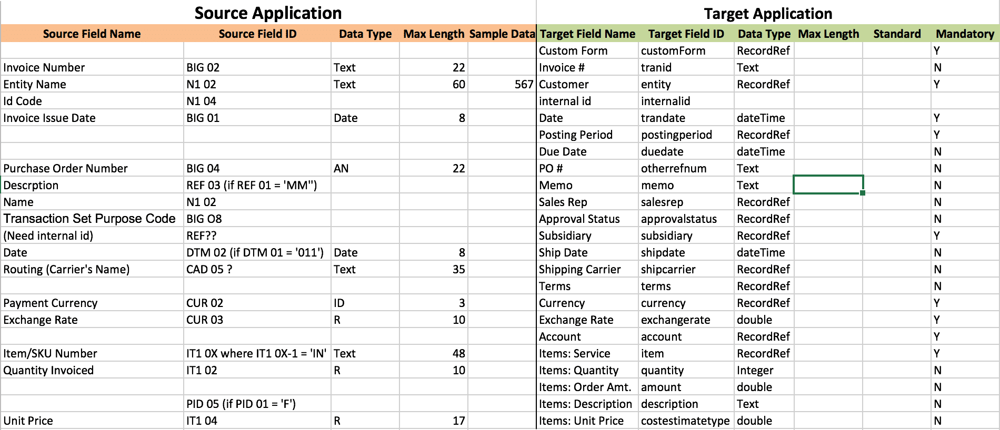

## w/c 29th July 2019

## Monday 29th July 2019

### What happened over the weekend

Applied for three jobs via the Hub. FundApps, Fluidly, and Smart Communications.

### Interview workshop with Jordan Roberts

Feedback from Jordan

```
Magnus	ArbuthnottQuestions:

Motivation
Tell	me	a	bit	about	yourself	and	your	background	and	why	you’re	pursuing	a	role	insoftware	development?●What	are	you	looking	for	in	a	role?
Where	do	you	see	yourself	in	5	years	time?

Genuine	Interest
What	is	your	favourite	coding	language? Why?
What	shows	us	that	you’re	going	to	keep	on	learning	to	become	an	experiencedsoftware	developer?
Do	you	go	to	any	meetups	or	hackathons	or	similar?
Are	you	more	interested	in	back-end	or	front-end	development? Why?
Can	you	name	me	any	technology	trends	excited	about?

Behaviour
What	was	the	most	challenging	aspect	of	Makers	and	how	did	you	overcome	it?
Can	you	think	of	a	situation	in	which	you	felt	you	hadn’t	communicated	well	enough. What	did	you	do?	How	did	you	handle	it?
How	has	your	previous	experience	made	you	a	better	developer?
What	would	you	bring	to	our	working	culture?
Tell	me	something	you’re	really	proud	of	achieving

Projects
Talk	to	me	about	your	Makers	final	project	-	what	did	you	contribute	specifically,	how	didyou	decide	to	work	on	it	and	talk	me	through	your	tech	stack?
Can	you	tell	me	about	any	challenges	in	your	final	project?
Can	you	tell	me	about	an	individual	project?
Have	you	ever	experienced	conflict	in	a	team	project?	How	did	you	solve	it?

Technical
Can	you	explain	to	me	what	the	Single	Responsibility	Principle	is?
Can	you	explain	to	me	the	‘Model	View	Controller’	architecture	you’ve	mentioned	onyour	CV?
What	is	each	part	responsible	for.	You	can	diagram	on	the	whiteboard	howthey	all	interact,	if	you’d	like.
What	are	the	benefits	of	pair	programming	and	is	there	anything	you	find	challengingabout	it?
Why	do	we	use	TDD?	Should	we	always	TDD?
Your	CV	talks	a	lot	about	Agile.	Can	you	tell	me	about	Agile	and	how	you	worked	in	an Agile	way?
What	is	encapsulation?
Tell	me	about	a	learning	process	you	have	used	at	Makers	that	you	have	found	helpful.
What	do	you	value	when	writing	code?

The	next	step
Do	you	have	any	preferences	in	terms	of	tech	stack?

FEEDBACK

You	come	across	as	calm	and	likeable	and	I	can	see	you	easily	building	up	a	good	rapport	withany	interviewer.	Even	when	you	weren’t	sure	of	an	answer	to	a	question	you	showedenthusiasm	and	willingness	to	give	it	your	best	shot,	which	I	think	is	a	great	trait.

As	I	mentioned	earlier,	your	previous	background	before	Makers	is	really	interesting	and	nodoubt	equipped	you	with	a	variety	of	great	transferrable	skills	-	don’t	be	afraid	to	mention	these	ifthey’re	relevant,	as	it	sets	you	apart	from	other	Makers.	For	example,	your	answer	to	myquestion	about	agile	was	really	good	and	unique	as	you	linked	it	to	your	time	in	the	army.

You	answer	questions	well	under	pressure,	even	when	the	questions	caught	you	off	guard,which	is	a	good	skill.	I	would	definitely	recommend	brushing	up	on	technical	concepts	though:OOP,	XP	values,	HTTP	request-response	cycle	etc.	Good	attempt	at	diagramming	MVCarchitecture	under	pressure	-	I	think	if	you	practice	this	sort	of	thing	and	practice	yourexplanations	you’ll	ace	it	in	a	tech	interview.

I	think	you	could	spend	time	preparing	answers	to	questions	that	show	a	genuine	interest	in	tech(have	a	look	at	the	sorts	of	questions	here:https://github.com/makersacademy/jobhunters/tree/master/pills/interviews	).	For	example,practice	answers	to	questions	about	what	your	favourite	coding	language	is	and	why.	If	youhaven’t	been	to	hackathons	and	meet	ups	(which	is	fine,	you’ve	only	just	finished	Makers!),	whatsort	of	things	have	you	been	doing	that	demonstrate	a	genuine	interest	in	tech?

You	mentioned	that	you	are	conscious	about	going	off	on	a	tangent	when	answering	a	questionand	don’t	want	to	come	across	like	you’re	showing	off.	I	understand	completely	what	you	mean,but	don’t	worry	too	much	about	this	as	you	weren’t	doing	these	things	at	all	and	I	think	worryingabout	them	dented	your	self-confidence	a	little	and	you	didn’t	allow	yourself	to	answer	aquestion	in	as	much	depth	as	you	were	capable	of	doing.

You	had	really	great	answers	to	the	motivation	questions	-	what	you	were	looking	for	in	a	roleand	why	you	were	pursuing	software	development	as	a	
```

### Worked on CV

Feedback from Becks on CV and how to align it closer to product roles as opposed to consulting.

```
Some feedback at last

I don’t have much constructive criticism - it’s well formatted and well evidenced throughout. Great job.

On paper you seem more suited for consulting roles over product roles - this is because of the skills you have chosen to draw out together with your Sandhurst background and work experience. It’s absolutely right to include this, it’s extremely rich in experiences to talk about but by stressing leadership, ops and strategy you are missing the ‘techie’ part of your personality that product roles look for.

Think about highlighting technical skills (similar to Chris Ly here https://github.com/defc0nONE/cv) and make going to Meetups, Hackathons a priority so you have some more technical depth to talk about at interview. You might start listening to a Tech Podcast to add to your list, too! I recommend :https://devchat.tv/js-jabber/

It’s just a couple of tweaks on your CV but a bit of a twist in your mindset.

What do you want to build and learn next? (edited) 

(that’s not a rhetorical question!)
```

## Tuesday 30th July 2019

### Work on feedback from interview prep

**Design Driven Development Strategy and Philosophy**

Great [link](https://martinfowler.com/bliki/UbiquitousLanguage.html) to explain.

1. Capture the domain model, in domain terms, through interactions with domain experts. In other words, talk to the people in the businesses where you are solving problems and understand them from their point of view first and foremost. This is how you form the ubiquitous language of the domain and set the foundation for harmonious models. *Ubiquitous language is the practice of building up a common, rigorous language between developers and users*.

2. Embed the domain terminology in the code. This means naming things the way the domain expert would name them, including classes, methods, commands, and especially domain events. This is how you reflect the domain model in the code.

3. Protect the domain knowledge from corruption by other domains, technical subdomains, etc. If you find that your code is talking about two different things—e.g., the domain solution and the technical implementation—separate those components to keep the subdomains apart. This strategy tends to result in classes with single responsibilities and a terse, focused vocabulary.

**Domain Model**

An object model of the domain that incorporates both behavior and data. The domain model is a representation of meaningful real-world concepts pertinent to the domain that need to be modeled in software.

A domain model generally uses the vocabulary of the domain, thus allowing a representation of the model to be communicated to non-technical stakeholders. It should not refer to any technical implementations such as databases or software components that are being designed.

**Object Oriented Design**

Object Oriented Design is the concept that forces programmers to plan out their code in order to have a better flowing program. It follows the following 5 principles:

1. *Encapsulation*: A tight coupling or association of data structures with the methods or functions that act on the data. This is called a class, or object (an object is often the implementation of a class).

2. *Data Protection*: The ability to protect some components of the object from external entities. This is realized by language keywords to enable a variable to be declared as private or protected to the owning class.

3. *Inheritance*: The ability for a class to extend or override functionality of another class. The so called child class has a whole section that is the parent class and then it has it's own set of functions and data.
Example:
```
class Car
  def initialize(make)
      @make = make
  end
  
  def start
    puts "#{@make} starting..."
    check_brakes
    engine.start
  end
end

class ElectricCar < Car
  def engine
    ElectricEngine.new
  end
end
 
class InternalCombustionCar < Car
  def engine
    InternalCombustionEngine.new
  end
end
```
4. *Interface*: A definition of functions or methods, and their signatures that are available for use to manipulate a given instance of an object. Good example at [link](https://dzone.com/articles/why-do-we-need-an-interface-in-oop).

As you can see, the interfaces allow us to define common behavior that can be implemented by any class, regardless of its inheritance. Although the AdventureLoverFriend class extends the Friend class and the Facebook class extends the MobileApplication class, we can add common distractable behavior to them by implementing the Distractable interface. This means that we can “cut across” the inheritance hierarchy to implement functionality as we see fit.

5. *Polymorphism*: Poly means many forms. So it basically means different types of the object. Polymorphism is a way of defining multiple functionalities under the same name. In other words we can say that we have the same code or operation but it will behave differently in different contexts.  Useful [link](https://thoughtbot.com/blog/back-to-basics-polymorphism-and-ruby#decorator-pattern).

It helps programmers reuse the code and classes once written, tested and implemented. They can be reused in many ways.

Polymorphism helps in reducing the coupling between different functionalities.

**Coupling and cohesion**

Great [link](https://www.rubyguides.com/2018/05/ruby-cohesion-and-coupling/).

1. *Coupling*: How dependent is a class to other classes, how “tied together” is it to the rest of the system, and the ability of this class to be used in isolation.
```
class ShoppingCart
  attr_accessor :items
  def initialize
    @items = []
  end
end
class Order
  def process_order(cart)
    cart.items.map(&:price).inject(:+)
  end
end
```

The Order class is highly coupled to ShoppingCart because it knows too much about it, it knows there is an items variable & it’s doing some calculation with that. In order to change this:
```
class ShoppingCart
  attr_accessor :items
  def initialize
    @items = []
  end
  def calculate_total
    items.map(&:price).inject(:+)
  end
end
class Order
  def process_order(cart)
    cart.calculate_total
  end
end
```

2. *Cohesion*: This is about the relationship between all the methods inside a class. Are they using the same set of instance variables & parameters, all working together towards the same goal? Or does every method feel separate from each other?
```
class Library
  def lend_book
  end
  def return_book
  end
  def make_coffee
  end
end
```
In this example make_coffee stands out quite a bit, even if this library has a cafeteria it makes no sense for the Library class to be making coffee. To fix this you'll need to extract the methods that don’t belong to this class to another class, often a new one.

**XP values**

Extreme Programming (XP) is a software development methodology which is intended to improve software quality and responsiveness to changing customer requirements. They are:

1. *Simplicity*: We will do what is needed and asked for, but no more. This will maximize the value created for the investment made to date. We will take small simple steps to our goal and mitigate failures as they happen. We will create something we are proud of and maintain it long term for reasonable costs. 

2. *Communication*: Everyone is part of the team and we communicate face to face daily. We will work together on everything from requirements to code. We will create the best solution to our problem that we can together.

3. *Respect*: Everyone gives and feels the respect they deserve as a valued team member. Everyone contributes value even if it's simply enthusiasm. Developers respect the expertise of the customers and vice versa. Management respects our right to accept responsibility and receive authority over our own work.

4. *Feedback*: We will take every iteration commitment seriously by delivering working software. We demonstrate our software early and often then listen carefully and make any changes needed. We will talk about the project and adapt our process to it, not the other way around.

5. *Courage*: We will tell the truth about progress and estimates. We don't document excuses for failure because we plan to succeed. We don't fear anything because no one ever works alone. We will adapt to changes whenever they happen.

**HTTP Request Response Cycle**

The request-response cycle begins with a client sending a request message to a server. The server handles the request and sends a response message back to the client. An HTTP message has a header and sometimes a body. The header contains meta-information (information about information, such as a document's, title, location, and subject) about the message. The body contains the content.

*REQUEST*
The request header consists of the request line, host, and name-value pairs (header fields). The request line contains the HTTP method and request-URI (URI is a string of characters used to identify a resource of a computer network, the most common is the web address or URL).

*Header*
```
GET / HTTP/1.1
Host: www.travisluong.com
User-Agent: Mozilla/5.0 (Macintosh; Intel Mac OS X 10.9; rv:34.0) Gecko/20100101 Firefox/34.0
Accept: text/html,application/xhtml+xml,application/xml;q=0.9,*/*;q=0.8
Accept-Language: en-US,en;q=0.5
Accept-Encoding: gzip, deflate
Connection: keep-alive
Cache-Control: max-age=0
```

*RESPONSE*

*Header*
```
HTTP/1.1 200 OK
Date: Sat, 20 Dec 2014 08:17:22 GMT
Server: Apache
Cache-Control: max-age=3600
Expires: Sat, 20 Dec 2014 09:17:22 GMT
Vary: User-Agent,Accept-Encoding
Content-Type: text/html; charset=UTF-8
```

*Body*
```
<html>
<head><title>Travis Luong</title></head>
<body>
  <h1>Hello, World!</h1>
  <p>foo</p>
</body>
</html>
```

Common status codes:

* 302 Found. Indicates that the resource requested has temporarily been moved to the URL. Commonly received after a POST request.
* 200 Ok. The request was fulfilled. Commonly received after a GET request.
* 404 Not Found. The URI that was requested could not be found in the server.


**Difference between High Level and Low Level programming language**

Low level language is machine readable form of program. Whereas the high level language will be in human readable form. Low level language are difficult to write and compile but high level languages are easy to write as well as compile.

Low level languages are essentially `assembly languages` and high level languages are how we write instructions.

**Agile Methodology**

1. Our highest priority is to satisfy the customer through early and continuous delivery of valuable software.

*Values*

1. Individuals and interactions over processes and tools.
2. Working software over comprehensive documentation.
3. Customer collaboration over contract negotiation.
4. Responding to change over following a plan.

**SOLID**

[link](https://itnext.io/solid-principles-explanation-and-examples-715b975dcad4)

**S** - Single Responsibility Principle
**O** - Open/Closed Principle - This states that software entities (classes, modules, functions) should be open for extensions, but closed for modification. i.e. utilising *inheritance* and *interfaces*.
**L** - Liskov Substitution Principle - The principle defines that objects of a superclass shall be replaceable with objects of its subclasses without breaking the application. That requires the objects of your subclasses to behave in the same way as the objects of your superclass.
**I** - Interface Segregation Principle - In programming, the interface segregation principle states that no client should be forced to depend on methods it does not use.
Put more simply: Do not add additional functionality to an existing interface by adding new methods.
**D** - Dependency Inversion Principle - This principle states that: 1. High-level modules should not depend on low-level modules. Both should depend on abstractions. 2. Abstractions should not depend on details. Details should depend on abstractions.

**Systems Integration Process**

6 Steps:

1. Requirements gathering

2. Analysis - in order to determine operational feasibility.

3. Architecture Design - writing a plan of how multiple components should be integrated so that they can function as a whole. Usually, blueprints of the integration are created to help both sides to visualise the process.

4. Systems Integration Design - the longest and the most challenging phase of the process where the actual integration is performed. Based on the architecture design which is rather a logical design, its physical equivalent is developed.

5. Implementation - Once the system is ready, it is verified and tested the order can go live.

6. Maintenance - The competitive advantage of having your subsystems integrated by a professional company over buying a new off-the-shelf solution is that a systems integrator makes sure your product works flawlessly even after it is released.

**APIs**

Application Programming Interface

An API is a standardised way to let software components talk to each other. There are the API consumers and API providers.

API Consumers:
* Web App
* Desktop App
* Server Apps
* Mobile Apps
* Devices (IoT)

API Providers:
* Google Maps
* Google login
* Salesforce
* News Sites
* Slack
* Twitter

Types of Web API:
* Open API - also known as public with no restrictions
* Partner APIs - need specific rights or licenses to access
* Internal APIs - little known. only internal systems expose this type of API.
* Comoposite APIs - 

Types of Web Service API:
* SOAP (Simple Object Access Protocol)
* REST (Representational State Transfer)
* XML-RPC
* JSON-RPC

API Architecture Styles:
* REST (Representational state transfer) - is it HTTP or SOAP
* Push/Streaming - webhooks
* RPC (Remote Procedural Cell) APIs
* Native/Browser
* GraphQL

**API Integration**

[emergetech API integration guide](https://emergetech.com/2017/12/21/api-integration/)
[Tray.io blog](https://tray.io/blog/what-is-an-api-integration-for-non-technical-people)

There are middleware options to manage API integrations, they do simple point-to-point connectors between two applications to behemoth enterprise software suites.
1. Lightweight SMB - map well to the needs of SMBs, but can't handle largers, more complex integrations.
2. Heavy-duty enterprise - offer a deeper suite of functionality.

Considerations:
* *Alerting* - will the solution you're looking into properly provide alerts for important events.
* *Pricing* - will your solution price integration service allow you to scale. Outdated services charge additional fees per user or per connector.
* *Data Scalability* - will your solution properly scale with your task related needs. You need a service that is capable of managing varying quantities of data while you scale your processes to flow more data between your various stack applications.
* *Connector Scalability* - will your solution add support for new connectors or enhance existing connectors. The best solution will have a proven history of creating native interactions very quickly.

**General Automation Platforms (GAP)**

* Full API integration
* Rapid connector updates
* Full automation with powerful branching & conditional logic: Automate processes using multiple cloud services, such as having marketing automation automatically update lead status in CRM based on conditional specs you design.
* Ease of use: A user-friendly interface that lets business users - not just engineers - directly integrate their tech stack to build automated workflows. The best GAPs have drag-and-drop interfaces that you can get started with in just minutes.
* Scalability: Scaling with your data usage and needs. Because GAPs are accessible and let business users build their own workflows, GAP users tend to grow their usage over time.
* Alerting & analytics: A GAP is equipped with full alerting and analytics capabilities to help users quickly diagnose any workflow issues and monitor data usage.

**API Integration**

API Integration is the process of creating a way for two or more API’s to communicate and share data without the need for human intervention.

The process:
1. Research and Prep:
Research should focus on finding out 3 things:
 - What type of API are we dealing with? REST, SOAP or RPC.
 - What data payload are we dealing with? Is it JSON, XML or both? This can normally be ascertained by the type of API.
 - Do we have the appropriate documentation? If the applications are popular, the documentation should be robust and come complete with a WSDL (Web Services Definition Language) for SOAP applications or a WADL (Web Application Description Language) for REST applications. Documentation will let developers know how to format their requests and what data is available.

2. Data Flow Planning:
Data flows are the objects or data you wish to transfer from one application to the other. Here are the considerations:
 - Authentication - Some API's and most private Web API's are protected by some form of security. Popular security protocols are `OAuth` and `SAML`. You should also consider how long you need to keep the authentication instance running. Will these data flows need to open continually or intermittently?
 - Timing/Volume/Speed - When, how often, and how much data needs to be transferred? An integration will only make sense if the data can get to the other system in a timely manner.
 - Data Discrepancies - Data must be in a format that is acceptable to the other end-point. This usually involves things like date/time formatting, and field size limitation.
 - CRUD - Create, Read, Update, and Destroy. When you're sending information the receiving API needs to know what to do with it.

3. Data Map:
A data map is the best way to make sure all the developers, consultants, and users are on the same page before the development begins and things become harder to change.

The data map will have the starting (Source) application on one side with all the objects you wish to transfer and all of the relevant information about those objects next to it. On the other (Target) side, you will list all the objects the starting objects will become once they are in the target system. Here is an example data map to give you a better idea of what we’re referring too. This is a screen shot of an invoice we moved over to NetSuite from another system.



4. Development
Self explanatory. If the remaining steps have been adhered to then it should flow.

5. Testing
It is ideal to have test environments for the applications you are connecting to best test the integration without disrupting production environments. It is also important to note that the end user should have a lot of input in the testing process.

 - Development Testing - Development testing involves unit testing and systems testing to ensure two things are happening. The first being that authentication has properly been accounted for, and the second being that the data is making its way to the endpoint properly.
 - Use-Case testing - Use-cases are scenarios that the integration will be expected to perform under. A good example would be making sure the integration can handle a spike in data related to a seasonal sales cycle.

### Different ways to declare a Javascript function

[6 ways to declare a javascript function](https://dmitripavlutin.com/6-ways-to-declare-javascript-functions/)

## Thursday 1st August 2019

### Interview prep

### Shell Interview

### Fluidly Interview

## Friday 2nd August 2019

### Learning React

Using this [link](https://www.youtube.com/watch?v=8GXXGJRDMdQ) handed over by Ranen Swilling.

Tyler McGinnis - Former Director at DevMountain

**ABOUT REACT**

React is a library for building user interfaces.

### JavaScript codecademy Intro

`//` hashes out code

multi line comments with `/*` and `*/`. Can also be used to comment out the middle of lines.

7 different data types in JavaScript:
* *Number*, including numbers with decimals.
* *String*, surround by single or double quotes, convention says single quotes.
* *Null*, represents the intentional absence of a value.
* *Boolean*, true or false.
* *Undefined*, represents the absence of data.
* *Symbol*, unique identifier.
* *Object*, collection of related data.

**STRINGS**
`.length` on a string prints the number of characters in that string including spaces.
`.toUpperCase()` on a string turns that string to uppercase.
`.startsWith('H')` on a string is True or False if that string begins with 'H'.
`.trim()` on a string removes all the empty spaces.

**NUMBERS**
`Math.floor(6.88)` will return 6 or round down to the nearest whole number.
`Math.random()` generates a random number between 0 and 1.
`Math.ceil(6.88)` will return 7 or round up to the nearest whole number.
`Number.isInteger(2019)` will return true and for any other integer.

**OBJECTS**
`Object.keys(objectName)` will return an array of a given objects property names.