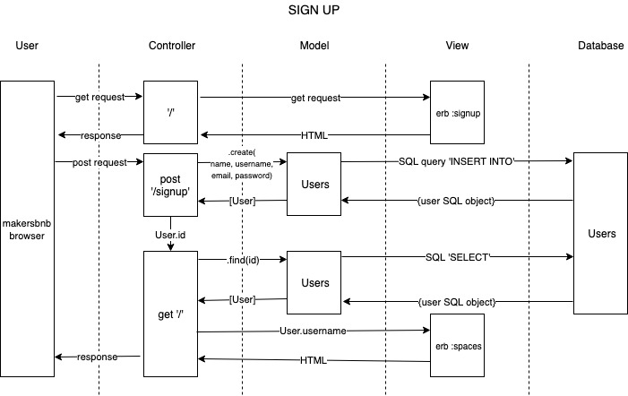

## Week 6
## w/c 3rd June 2019

### Questions

* using `module exports` at the bottom of the file
* different syntax use. using `class`.

### Week Goals

## Mon 3rd June 2019

### Cont with bowling challenge

* `array.reduce(function(total, currentValue, currentIndex, arr), initialValue)` using the .reduce function where:
  * total =>	Required. The initialValue, or the previously returned value of the function
  * currentValue =>	Required. The value of the current element
  * currentIndex =>	Optional. The array index of the current element
  * arr =>	Optional. The array object the current element belongs to

### Intro to MakersBnB

* Use of Trelo to manage project
* Use of issues - branches on github
* XP values
* Agile
* Daily Stand Ups and Retros
* Use sinatra
* Keep quality of code and test coverage high

### Start MakersBnB

* Any signed-up user can list a new space.
```
As a new user,
So I can use a new space,
I would like to sign up to Makers BnB with name, username, email, and password.

As a user,
So I use a new space,
I would like to login to my Makers BnB account.
```

* Users can list multiple spaces.
```
As a user,


```
* Users should be able to name their space, provide a short description of the space, and a price per night.
* Users should be able to offer a range of dates where their space is available.
* Any signed-up user can request to hire any space for one night, and this should be approved by the user that owns that space.
* Nights for which a space has already been booked should not be available for users to book that space.
* Until a user has confirmed a booking request, that space can still be booked for that night.

* `gem launchy` use

**Datamapper**

* One API for a variety of datastores
DataMapper comes with the ability to use the same API to talk to a multitude of different datastores. There are adapters for the usual RDBMS suspects, NoSQL stores, various file formats and even some popular webservices.

* [Datamapper setup tutorial](https://code.tutsplus.com/tutorials/ruby-for-newbies-working-with-datamapper--net-19622)

* [Datamapper offical docs](https://datamapper.org/)

## Monday 3rd June 2019

**Daily Goals**

* Continue with Makers BnB challenge

### Makers BnB

* Morning spent reconfiguring DataMapper and linking with a remote database hosted on Heroku. Chris Plant set up.

* Created database model:


## Wednesday 5th June 2019

### Makers BnB

* Finalised sign in and login functions on Makers BnB. Working with Cosmin.

* Created sign up domain model:


* Created features flow chart:
