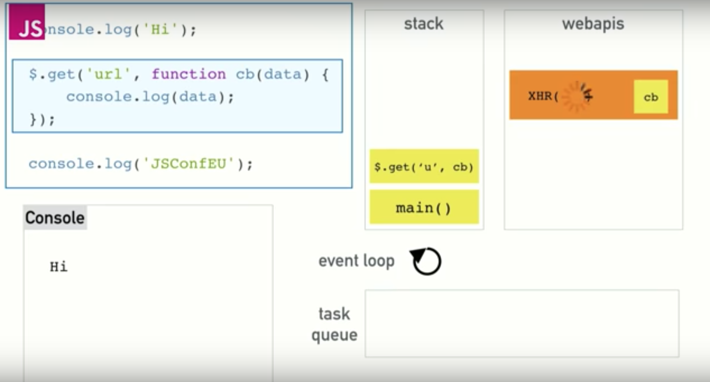

## Week 6
## w/c 3rd June 2019

### Questions

* using `module exports` at the bottom of the file
* different syntax use. using `class`.

* How to utilise DOM methods within JavaScript feature tests? [Notebook challenge](https://github.com/makersacademy/course/blob/master/further_javascript/frontend_single_page_app_guidance.md)

* What is the purpose behind:
```js
(function(exports) {
  function Circle() {
    ...
  };
  exports.Circle = Circle
})(this);
```

* What is best practice... hiding and unhiding elements of the page, or, destroying and creating elements of the page?

* Use of form when not using 'post' method with sinatra.

* When do we use the module pattern?? Is it just to keep methods private.

### Week Goals

## Monday 10th June 2019

### Weekend challenge review

* w/ Alice Lieutier

* Hash is javascript. Hashes are objects in javascript.
Possible solutions:
```js
var a = {1: 'a'}
a[1] = 3
```

* Differences in syntax:
```js
class Game {
  roll(rolls) {
    ...
  }
}
```
This is ES6 which stands for Ecma Script; this defines that there should be classes and functions. It is a standard of the language.

```js
var Game = function() {
};

Game.prototype.roll = function(rolls) {
  ...
};
```
This is ES3/5. More widely used programming standard.

* [Airbnb's JavaScript guide](https://github.com/airbnb/javascript). Very in depth explanation of JavaScript

**Retro on MakersBnB**
USEFUL
* Feature diagrams to map out the web pages
* Communicating regularly
* Changing pairs every half day. But a member of the pair on the same feature to avoid pairs becoming overwhelmed.

**Preparing for the week**
* Create a front end app with the use of no libraries, i.e. no Jasmine and JQuery.

### Notebook challenge

* w/ Ollie Brownlow, Laurence Taylor, and Nick Barnes

**Pre reading**

* `HTTP-Server` to run the server. [HTTP-Server](https://github.com/makersacademy/course/blob/master/pills/http_server.md)

* [Writing tests without a testing library](https://github.com/makersacademy/course/blob/master/pills/writing_tests_without_a_testing_library.md)

* `form submit event` and `preventDefault` to intercept form submissions when not wanting to reload the page. [preventDefault example](https://developer.mozilla.org/en-US/docs/Web/API/Event/preventDefault)

* To run a server without using a library such as Jasmine:
```
$ npm install http-server --save
$ node node_modules/http-server/bin/http-server
```

- Draw features
- Set up tests. Write tests a test library:
  - expect
  - toEq
  - Suggests using DOM methods to help with feature tests
-

## Tuesday 11th June 2019

### Daily goals

* Continue working through JavaScript pills.
* Continue on bowling challenge.
* Work within the group on notebook.

### JavaScript Pills

* [Makers learning pills](https://github.com/makersacademy/course/blob/master/pills.md)

**Immediately Invoked Function Expression (IIFE)**
```js
(function () {
  var EXCLAMATION_MARK_COUNT = 5

  function exclaim(string) {
    return string + "!".repeat(EXCLAMATION_MARK_COUNT);
  };

  console.log(exclaim("hi"));
})();
```
**Module Pattern**
A design pattern to encapsulate your JavaScript code. The module pattern is basically just an IIFE.

But it uses a bit of extra code to export (or expose, or make available to the outside, or show) functions and variables that are part of the public interface of the module.

Here is an example of the module pattern using similar code to our IIFE:
```js
(function(exports) {
  var EXCLAMATION_MARK_COUNT = 5

  function exclaim(string) {
    return string + "!".repeat(EXCLAMATION_MARK_COUNT);
  };

  exports.exclaim = exclaim;
})(this);

// prints "hi!!!!!"
console.log(exclaim("hi"));

// throws a ReferenceError
console.log(EXCLAMATION_MARK_COUNT);
```
So we can access exclaim, but EXCLAMATION_MARK_COUNT is hidden. We've made available the function we want to use but have hidden some implementation details.

### Notebook Challenge

* [Makers notes app repo](https://github.com/makersacademy/course/tree/master/further_javascript)

**Writing tests without the testing library**

* Create a `runner.js` which iteratively runs the tests. Call it in `index.html`.

**MODELING**

FEATURE MODEL


MVC MODEL


**APPROACH**

BUILDING OUR TESTING FRAMEWORK

* Created `assert.js` and began by replicating tests we had previously used with Jasmin. i.e. `isTrue`, `isEqual`, and `includes`. Within each testing function we have an `if else` statement to throw an error in red or `console.log()` a green message if passed.

* Created `notesSpec.js` and started writing our unit tests starting with `createNotesObject`.

* Created `runner.js` to iterate through our tests and apply our framework in `assert.js`. Each unitSpec file requires `runner.runTests(notesSpec);` at the base of the file in order to allow access to the runner.

* Finally we added a basic `specRunner.html` to call the files in our spec directory and the `notes.js` that we were to create in our model.

## Wednesday 12th June 2019

### Daily Questions

* `undefined` when executing handler

### Daily goals

### Notebook challenge
* throwError matcher
* Hide textarea when viewing full note
* Back button

* README.md
* Clean up the code

* Ajax
* Gosling's face (CSS)
* Delete/edit 

JavaScript is now the default HTML scripting language. Originally it would have been specified using:
```js
<script type="text/javascript">
  alert("This is an alert box!");
</script>
```

### Async and callbacks - JS Workshop

* w/ Alice Lieutier

* Video!!

Simply passing a function to another function is called a **callback** (99% of the time).

An **event Handler** is a statement that is executed when a certain event happens. i.e. a click.

* callbacks start with searching the element within the document:
  - when using solely `document` in the console it will return all elements.
if `<div id ="a">Hello</div>`
```js
a = document.getElementById("a")
a.addEventListener('click', function(clickEvent) {
  // function to occur on a click
})
```
* the function within the `addEventListener` is call the click handler and is a callback.
* and the `click` is the event. Other events include `mouseover`.

* `setTimeout(handler, 2000)` here there is a delay of 2 seconds (2000 milliseconds) before it calls handler.
 - If the timeout is a large number. Use `clearTimeout(number of timeout in order)`

* **Error stack** represents the flow of an error. (What we see when an error occurs from our spec.)

* JavaScript assigns `undefined` to any object that has been declared but not initialized or defined. In other words, in a case where no value has been explicitly assigned to the variable, JavaScript calls it 'undefined'. 2. Array index or object property that does not exist.

## Thursday 13th June 2019

### Daily goals

* View 'event loop' video from Alice Lieutier.

### Event loop video notes

* [What the heck is the event loop anyway? | Philip Roberts | JSConf EU](https://www.youtube.com/watch?v=8aGhZQkoFbQ)

- Synchronous - execute only one thing at a time
- Asynchronous - execute multiple things at a time

JavaScript is inherently synchronous, when using the event loop and time out it is possible to make it asynchronous.



* Task queue - All event on the page are sent here before being moved to the call stack. They are only moved to the call stack once it is empty.
* Call Stack - where the functions are queued to be executed.
* webapis - If a function has a timeout, (usually used in conjunction with a web api, to allow it to load) it is moved to the webapis where it runs down it's counter. ONce the counter has finished it is staged in the task queue for execution.

The **event loop** is all these elements combined.

* The browser will repaint the screen about 60 times a minute.

* **Heap** is memory allocation.

### Live code Notes App

* w/ Alice Lieutier

**ANALYSE USER STORIES**

- See a list of notes:
  - Each abbreviated

- Create a new note

- See the whole note on its own page

Prioritize. Logically it would be a good idea to work on the 2nd user story to create a note, however, possible to work on the first user story initially by hardcoding notes.

**CONSTRUCT MODEL**

This is optional. Possible to start on interface or html.

Start by pulling out the testing framework. This cold be Jasmine or something individually created. For a good testing framework, [Alice Lieutier - test framework](https://github.com/alicelieutier/test_framework).

* Testing state - is testing its implementation. “I don’t care what the answer is, just make sure you do this thing while figuring it out.”
* Testing behavior - “I don’t care how you come up with the answer, just make sure that the answer is correct under this set of circumstances.”

* Write a test to check for the presence of a note and then write code.

**CONSTRUCT HTML and INTERFACE**

* to style background:
```js
var body = document.getElementById('body');
body.style.background = 'green';
```

* set index.html and call the relevant files below the 'body' tag.

* use:
```js
window.onload = function() {
  // all the interface code
}
```

`$0` in the console will equal the last element you call / used `getElementById` against.

`.value` will return the text in a text area but had no button executed against it.

### Notes Challenge

* w/ Ollie, Nick, and Laurence

## Friday 14th June 2019

### Daily Goals

* Complete README.md and APPROACH.md for Notes App.
* Start weekend challenge