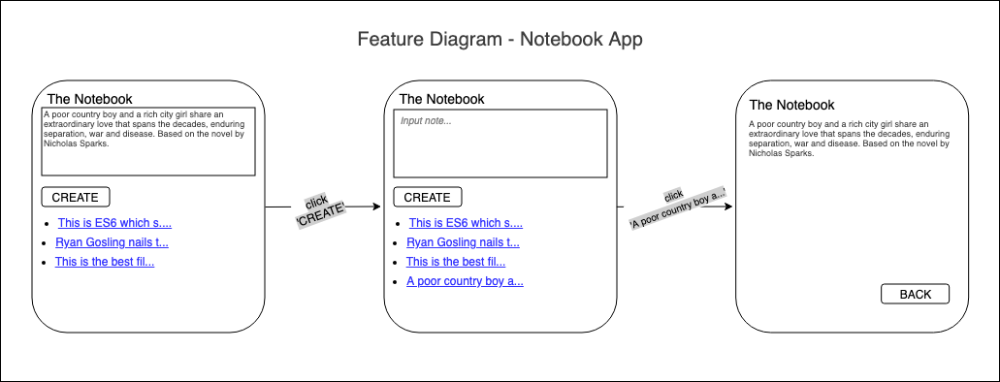

## Week 6
## w/c 3rd June 2019

### Questions

* using `module exports` at the bottom of the file
* different syntax use. using `class`.

* How to utilise DOM methods within JavaScript feature tests? [Notebook challenge](https://github.com/makersacademy/course/blob/master/further_javascript/frontend_single_page_app_guidance.md)

* What is the purpose behind:
```js
(function(exports) {
  function Circle() {
    ...
  };
  exports.Circle = Circle
})(this);
```

### Week Goals

## Monday 10th June 2019

### Weekend challenge review

* w/ Alice Lieutier

* Hash is javascript. Hashes are objects in javascript.
Possible solutions:
```js
var a = {1: 'a'}
a[1] = 3
```

* Differences in syntax:
```js
class Game {
  roll(rolls) {
    ...
  }
}
```
This is ES6 which stands for Ecma Script; this defines that there should be classes and functions. It is a standard of the language.

```js
var Game = function() {
};

Game.prototype.roll = function(rolls) {
  ...
};
```
This is ES3/5. More widely used programming standard.

* [Airbnb's JavaScript guide](https://github.com/airbnb/javascript). Very in depth explanation of JavaScript

**Retro on MakersBnB**
USEFUL
* Feature diagrams to map out the web pages
* Communicating regularly
* Changing pairs every half day. But a member of the pair on the same feature to avoid pairs becoming overwhelmed.

**Preparing for the week**
* Create a front end app with the use of no libraries, i.e. no Jasmine and JQuery.

### Notebook challenge

* w/ Ollie Brownlow, Laurence Taylor, and Nick Barnes

**Pre reading**

* `HTTP-Server` to run the server. [HTTP-Server](https://github.com/makersacademy/course/blob/master/pills/http_server.md)

* [Writing tests without a testing library](https://github.com/makersacademy/course/blob/master/pills/writing_tests_without_a_testing_library.md)

* `form submit event` and `preventDefault` to intercept form submissions when not wanting to reload the page. [preventDefault example](https://developer.mozilla.org/en-US/docs/Web/API/Event/preventDefault)

* To run a server without using a library such as Jasmine:
```
$ npm install http-server --save
$ node node_modules/http-server/bin/http-server
```

- Draw features
- Set up tests. Write tests a test library:
  - expect
  - toEq
  - Suggests using DOM methods to help with feature tests
-

## Tuesday 11th June 2019

### Daily goals

* Continue working through JavaScript pills.
* Continue on bowling challenge.
* Work within the group on notebook.

### JavaScript Pills

* [Makers learning pills](https://github.com/makersacademy/course/blob/master/pills.md)

**Immediately Invoked Function Expression (IIFE)**
```js
(function () {
  var EXCLAMATION_MARK_COUNT = 5

  function exclaim(string) {
    return string + "!".repeat(EXCLAMATION_MARK_COUNT);
  };

  console.log(exclaim("hi"));
})();
```
**Module Pattern**
A design pattern to encapsulate your JavaScript code. The module pattern is basically just an IIFE.

But it uses a bit of extra code to export (or expose, or make available to the outside, or show) functions and variables that are part of the public interface of the module.

Here is an example of the module pattern using similar code to our IIFE:
```js
(function(exports) {
  var EXCLAMATION_MARK_COUNT = 5

  function exclaim(string) {
    return string + "!".repeat(EXCLAMATION_MARK_COUNT);
  };

  exports.exclaim = exclaim;
})(this);

// prints "hi!!!!!"
console.log(exclaim("hi"));

// throws a ReferenceError
console.log(EXCLAMATION_MARK_COUNT);
```
So we can access exclaim, but EXCLAMATION_MARK_COUNT is hidden. We've made available the function we want to use but have hidden some implementation details.

### Notebook Challenge

* [Makers notes app repo](https://github.com/makersacademy/course/tree/master/further_javascript)

**Writing tests without the testing library**

* Create a `runner.js` which iteratively runs the tests. Call it in `index.html`.

**MODELING**

FEATURE MODEL


MVC MODEL
